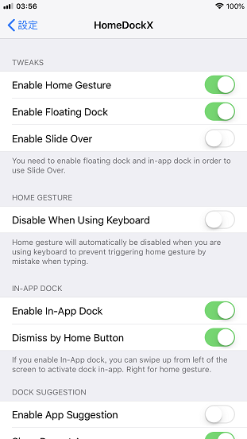
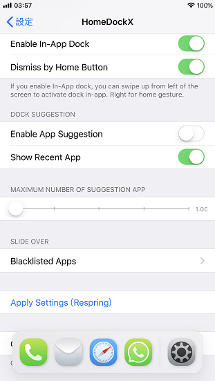

<center>
<h2>

  
HomeDockX  

</h2>

iPhone X gesture with perfectly compatible iPad floating dock  
Works well on iOS 11.3.1 with Electra1131

**This tweak is designed for classic iPhones (iPhone that without notch)**
</center>


## Features
- Enable iPhone X home gesture
- Enable iPad floating dock
- Enable in-app floating dock
- Dismiss in-app dock by pressing physical home button
- Enable iPad Slide Over
- iPad Slide Over app blacklisting
- Disable home gesture when using keyboard
- Bridge home gesture and floating dock gesture *


```
* If you enable both home gesture and in-app dock together, 
swipe up from left of the screen will activate in-app dock. 
Right for home gesture.
```


## Screenshots




## Downloads
See [Release](https://github.com/brian9206/HomeDockX/releases/latest)


## Credits
This tweak used some code from the following tweaks with adjustments.
- [Home Gesture](https://github.com/VitaTaf/HomeGesture) by VitaTaf
- [FloatingDockXI](https://github.com/KpwnZ/FloatingDockXI) by KpwnZ
